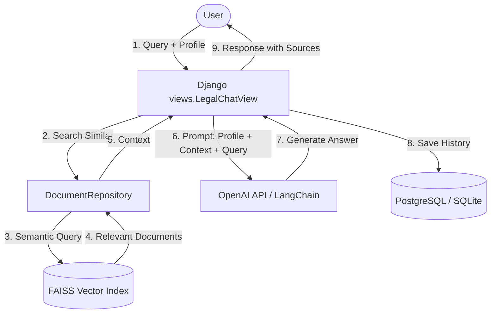

# 🛡️ Military Legal Support Assistant

[](https://www.python.org/)
[](https://www.djangoproject.com/)
[](https://react.dev/)
[](https://openai.com/)
[](https://www.langchain.com/)
[](https://github.com/facebookresearch/faiss)
[](https://www.docker.com/)

**Military Legal Support Assistant** is an intelligent web platform designed to provide legal consultations for Ukrainian military service members, veterans, and their families. The system automates the retrieval of up-to-date legislative documents and uses **RAG (Retrieval-Augmented Generation)** technology to deliver personalized guidance regarding reports, military medical commissions (VLC), status applications, benefits, and other legal matters.

---

## 🏗️ System Architecture (RAG Flow)

The system leverages semantic search over a knowledge base of Ukrainian military legislation using a FAISS vector index, generating responses via OpenAI models integrated with LangChain.



---

## ✨ Key Features

- **🤖 Intelligent Legal Consultations (RAG)**: Personalized answers tailored to the user's military profile and current document status.
- **📚 Integrated Knowledge Base**: A database of laws, statutes, resolutions, and orders with automated indexing support.
- **👤 User Profiles**: Tailored advice based on military status (Mobilized, Contract, Veteran, Cadet, etc.) and branch of service (AFU, National Guard, TDF, SBGS, SOF, etc.).
- **📂 Context Awareness**: Users can specify the category of their issue, document availability (e.g., report filed, VLC decision received), and current stage of the situation to get highly targeted guides.
- **💬 Session History**: Support for creating and managing multiple independent chat sessions.
- **🔗 Reference to Sources**: Every response includes a list of official legal documents used to formulate the consultation.

---

## 📁 Directory Structure

```text
diplom/
├── backend/                  # Django REST Framework backend
│   ├── core/                 # Main application (models, views, RAG services)
│   │   ├── management/       # Custom Django management commands (data loading & indexing)
│   │   ├── patterns/         # Adapters and repositories (OpenAI & FAISS integration)
│   │   └── tests/            # API and service unit tests
│   ├── data/                 # Raw data (legal documents in JSON format)
│   ├── diplom/               # Django project configuration
│   ├── faiss_index/          # Local FAISS vector index store
│   ├── Dockerfile            # Backend Docker configuration
│   └── docker-compose.yml    # Docker Compose for the entire application stack
└── frontend/                 # React frontend
    ├── src/                  # SPA application source code
    └── Dockerfile            # Frontend Docker configuration
```

---

## ⚙️ Environment Configuration (`.env`)

To run the backend, create a `.env` file in the `backend/` directory using the provided `.env.example` template:

| Variable | Description | Example |
|:---|:---|:---|
| `DJANGO_SECRET_KEY` | Secret key for Django application | `your-secret-key-here` |
| `DEBUG` | Enable debug mode | `True` |
| `ALLOWED_HOSTS` | Allowed host headers | `localhost,127.0.0.1` |
| `DB_NAME` | PostgreSQL database name | `diplom_db` |
| `DB_USER` | PostgreSQL user | `diplom_user` |
| `DB_PASSWORD` | PostgreSQL password | `diplom_password` |
| `DB_HOST` | Database host (use `db` for Docker Compose) | `db` |
| `DB_PORT` | Database port | `5432` |
| `OPENAI_API_KEY` | API key for OpenAI | `sk-proj-...` |
| `FAISS_INDEX_PATH` | Directory to save the FAISS index | `faiss_index` |

---

## 🚀 Getting Started (Docker Compose)

The application stack is fully containerized using Docker and Docker Compose. This starts a PostgreSQL database, the Django backend, and the React frontend.

> [!IMPORTANT]
> Ensure you have configured the `backend/.env` file before running the containers, specifically adding a valid `OPENAI_API_KEY`.

### 1. Spin up the Containers

Navigate to the `backend` directory and start the services in detached mode:
```bash
cd backend
docker-compose up -d --build
```

### 2. Database & Search Index Setup

Run database migrations, import document seeds, and build the vector database directly inside the running backend container:

```bash
# Apply database migrations
docker-compose exec backend python manage.py migrate

# Load initial legal documents from data/documents.json
docker-compose exec backend python manage.py load_documents

# Generate the FAISS vector index (requires OPENAI_API_KEY in .env)
docker-compose exec backend python manage.py build_vector_index
```

### 3. Application Access

Once the containers are running and indexed, the services are accessible at:
- **Frontend SPA**: [http://localhost:3000](http://localhost:3000)
- **Backend API**: [http://localhost:8000/api](http://localhost:8000/api)
- **Django Admin Interface**: [http://localhost:8000/admin](http://localhost:8000/admin)

---

## 🧪 Running Tests

You can execute backend tests directly inside the running container using `pytest`:

```bash
docker-compose exec backend pytest
```

---

## 📝 License

This project was developed as part of a diploma thesis. All rights reserved.
